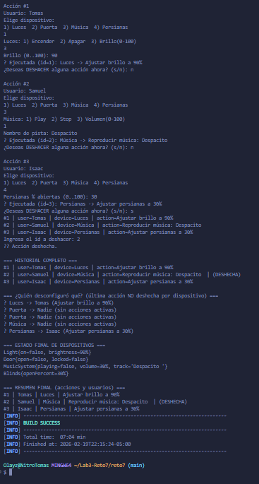

## Reto 7 - Control Remoto Mágico

### Patrón de Diseño
Comportamiento (Behavioral)

### Patrón Utilizado
Command

### Justificación
Se requieren acciones sobre varios dispositivos con parámetros, registrar quién las ejecuta, mantener historial completo, permitir deshacer una acción individual y mostrar un resumen final. El patrón Command encapsula cada acción como un objeto con execute() y undo().

### Cómo lo aplico
- Receivers: Light, Door, MusicSystem, Blinds
- Command: interfaz Command (execute/undo/description/deviceName)
- ConcreteCommands: LightCommand, DoorCommand, MusicCommand, BlindsCommand (guardan estado previo para undo)
- Invoker: MagicRemote (ejecuta, registra historial, permite undo por id)
- Cliente: Reto7Runner (pide X acciones, usuario, muestra historial y resumen)